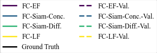

# The Impact of Fusion Modules for Change Detection with Deep Learning

Change detection is the procedure of detecting semantic, meaningful differences between two images at time T1 and time T2 and outlining them on an output Y.

This experiment examines the impact of different fusion modules on the matter.

Full experiment and methodology discussion can be found at [TU Delft Repository](https://repository.tudelft.nl/record/uuid:261fdb0e-a6f2-498a-bc67-9622823d6142).

## Motivation

The purpose of this experiment is to examine the impact of how changing the location of the fusion module impacts change detection results. The idea is that this architecture difference correlates with different sizes of objects being detected. If a statistically significant impact is found, future deep learning architectures for change detection would be better informed on how they can be structured depending on the resources and task.


## Project Setup

**Folder Structure**:

```
|_/evaluation           # Functions to evaluate training/test results, put them into tables and aggregate them 
|_/preprocessing        # Various preprocessing utility functions 
|_/pytorch_datasets     # Pytorch dataloaders per dataset with its own preprocessing steps 
|_/siamese_fcn          # The location of all fusion models: FC-EF (Early), FC-Siam-Conc (Middle), FC-Siam-Diff (Middle)
                        # and FC-LF (Late) 
|_/visualization        # Folder containing various figure creation/visualization scripts used for the final paper and 
                        # normal data analysis.
experiment.py           # Python Script running a single experiment on all fusion types 
experiments.ipynb       # Jupyter notebook for a simple experiment setup/ablations 
requirements.txt        # All python dependencies that need to be installed 
train_test.py           # Python script containing the model training loop
```

The project assumes an external `data` folder, found one directory above the git repository. Look at the `pytorch_datasets` folder to see how all of them are standardized.

The recommended project setup is as follows:

1. Upload the entire repository to Google Drive and synchronize it freely.
2. Compress all datasets to `.zip` files and unpack them in Google Colab's cache for running experiments (Colab's bottleneck is not amount of data, but number of items).
3. Run experiments in `experiments.ipynb` on Google Colab (any GPU), similar to the way in the presented Jupyter notebook.

## Datasets

Currently, the experiment can be applied on 4 datasets - three normal change detection ones and one synthetic one. The synthetic dataset creation procedure and the dataset loaders are all in the `pytorch_datasets` folder.

A short description of each one is provided below:

- **LEVIR-CD**: One of the largest change detection datasets - based on imagery from Google Earth. [LEVIR-CD](https://chenhao.in/LEVIR/)
- **HiUCD**: Categorical change detection dataset of Tallinn. [HiUCD Paper](https://arxiv.org/abs/2011.03247)
- **HRSCD**: Categorical dataset with landcover map labels per pixel. [HRSCD](https://rcdaudt.github.io/hrscd/)
- **CSCD**: Synthetic dataset, made with morphological operations, in four categories - Small and Large Uniform and Non-Uniform Changes

Further details in the paper/s listed below the title.

## Extending the Experiments

All of the currently known possible extensions to the experiment are outlined as issues. Feel free to contribute other extensions and submit them for review. 

## Hardware Requirements

To run the experiment pipeline, it is highly recommended a CUDA-compatible GPU is used. Not a requirement, but something to keep in mind for the future researchers' sanity.


## Miscelaneous

Throughout the project, legends are largly absent from aggregate plots to conserve space (for the aftermath paper). There is a separate `legend.py` script for the paper. The color scheme per fusion architecture is consistent and is illustrated below: 




## Acknowledgements

The codebase presented here is partially based on extending the following project:

- [Fully Convolutional Change Detection](https://github.com/rcdaudt/fully_convolutional_change_detection/tree/master)

The code lent is visible in the `siamese_fcn` folder.

This repository is part of the CSE3000 Research Project at TU Delft on the topic of "Urban Change Detection from Remote Sensing Data". It has additionally been done with supervision from Prof. Dessislava-Petrova Antonova from GATE Institute.

## Contact

In case any technical issues or questions arise, feel free to contact me at the following addresses:

- <v.dakov02@gmail.com>
- <Vasil.Dakov@gate-ai.eu>
- <V.D.Dakov@student.tudelft.nl>

## References

For additional information, please consult the sources listed here (order is arbitrary). These are the primary sources of information used while creating this project.

1. I. S. Serasinghe Pathiranage, L. N. Kantakumar, and S. Sundaramoorthy, “Remote Sensing Data and SLEUTH Urban Growth Model: As Decision Support Tools for Urban Planning,” Chinese Geographical Science, vol. 28, pp. 274–286, Apr. 2018.
2. F. Dahle, K. Arroyo Ohori, G. Agugiaro, and S. Briels, “Automatic change detection of digital maps using aerial images and point clouds,” The International Archives of the Photogrammetry, Remote Sensing and Spatial Information Sciences, vol. XLIII-B2-2021, pp. 457–464, 2021.
3. S. Xu, G. Vosselman, and S. Oude Elberink, “Detection and classification of changes in buildings from airborne laser scanning data,” ISPRS Annals of the Photogrammetry, Remote Sensing and Spatial Information Sciences, vol. II-5/W2, pp. 343–348, 2013.
4. E. Shelhamer, J. Long, and T. Darrell, “Fully Convolutional Networks for Semantic Segmentation,” May 2016. arXiv:1605.06211 [cs] version: 1.
5. O. Ronneberger, P. Fischer, and T. Brox, “U-Net: Convolutional Networks for Biomedical Image Segmentation,” May 2015. arXiv:1505.04597 [cs].
6. R. Caye Daudt, B. Le Saux, and A. Boulch, “Fully Convolutional Siamese Networks for Change Detection,” in 2018 25th IEEE International Conference on Image Processing (ICIP), pp. 4063–4067, Oct. 2018. ISSN: 2381-8549.
7. “Change Detection in Multisource VHR Images via Deep Siamese Convolutional Multiple-Layers Recurrent Neural Network | IEEE Journals & Magazine | IEEE Xplore.”
8. H. Chen and Z. Shi, “A Spatial-Temporal Attention-Based Method and a New Dataset for Remote Sensing Image Change Detection,” Remote Sensing, vol. 12, p. 1662, Jan. 2020. Number: 10 Publisher: Multidisciplinary Digital Publishing Institute.
9. G. Cheng, Y. Huang, X. Li, S. Lyu, Z. Xu, Q. Zhao, and S. Xiang, “Change Detection Methods for Remote Sensing in the Last Decade: A Comprehensive Review,” May 2023. arXiv:2305.05813 [cs, eess].
10. W. Shi, M. Zhang, R. Zhang, S. Chen, and Z. Zhan, “Change Detection Based on Artificial Intelligence: State-of-the-Art and Challenges,” Remote Sensing, vol. 12, p. 1688, Jan. 2020. Number: 10 Publisher: Multidisciplinary Digital Publishing Institute.
11. D. H. Hubel and T. N. Wiesel, “Receptive fields, binocular interaction and functional architecture in the cat’s visual cortex,” The Journal of Physiology, vol. 160, pp. 106–154.2, Jan. 1962.
12. M. H. Herzog and A. M. Clarke, “Why vision is not both hierarchical and feedforward,” Frontiers in Computational Neuroscience, vol. 8, Oct. 2014. Publisher: Frontiers.
13. S. Tian, A. Ma, Z. Zheng, and Y. Zhong, “Hi-ucd: A large-scale dataset for urban semantic change detection in remote sensing imagery,” 2020.
14. U. Michelucci, “An introduction to autoencoders,” 1 2022.
15. J. Bromley, I. Guyon, Y. LeCun, E. Sackinger, and R. Shah, “Signature Verification using a ‘Siamese’ Time Delay Neural Network,” in Advances in Neural Information Processing Systems, vol. 6, Morgan-Kaufmann, 1993.
16. D. Chicco, “Siamese Neural Networks: An Overview,” in Artificial Neural Networks (H. Cartwright, ed.), pp. 73–94, New York, NY: Springer US, 2021.
17. P. Soille, Morphological Image Analysis. Berlin, Heidelberg: Springer, 2004.
18. “OpenCV: Morphological Transformations.”
19. “NLLLoss — PyTorch 2.3 documentation.”
20. “OpenCV: Contour Features.”
21. S. Suzuki and K. be, “Topological structural analysis of digitized binary images by border following,” Computer Vision
